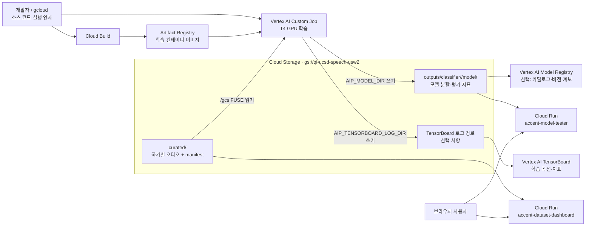
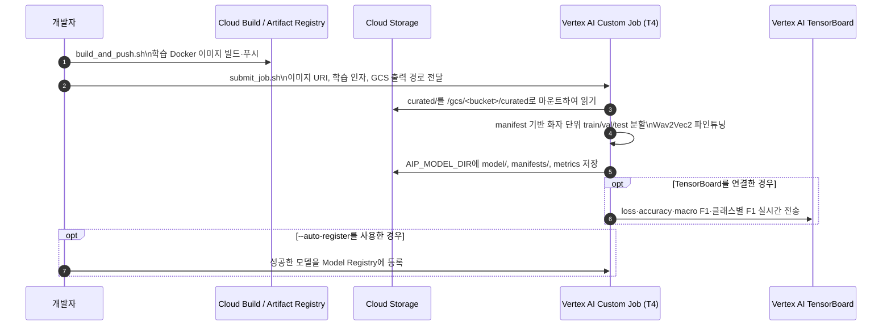

# Classifier의 GCP 활용 구조

> 대상: `qi-ucsd-project` · 기본 리전: `us-west2` · 주 데이터 버킷: `gs://qi-ucsd-speech-usw2`

## 한눈에 보는 전체 흐름



## 학습 경로 — 표준 운영 흐름



## 서비스 경로 — 학습 후 데이터 확인과 추론

```mermaid
flowchart TB
    U[브라우저] --> DASH[Cloud Run\nDataset Dashboard]
    U --> TEST[Cloud Run\nModel Tester]

    DASH -->|오디오를 내려받지 않고\n객체 메타데이터·manifest 읽기| DATA[(GCS curated/)]
    TEST -->|모델 목록 조회 및\n선택한 가중치를 인스턴스 메모리에 캐시| MODEL[(GCS outputs/classifier/)]
    AUDIO[사용자 업로드 / 녹음 오디오] --> TEST
    TEST --> RESULT[서버 측 추론 결과\n국가별 확률·평가 지표]

    SA[Cloud Run 런타임\n서비스 계정] -. roles/storage.objectViewer .-> DATA
    SA -. roles/storage.objectViewer .-> MODEL
```

## 구성 요소별 역할

| GCP 구성 요소 | 이 classifier에서 하는 일 | 실제 코드/스크립트 |
|---|---|---|
| Cloud Storage | curated 오디오·매니페스트의 원본 저장소, 학습 산출물과 TensorBoard 로그 저장소 | `DATASET.md`, `src/config.py`, `gcloud/submit_job.sh` |
| Cloud Build | 로컬 Docker 없이 학습/Cloud Run 이미지를 빌드 | `gcloud/build_and_push.sh`, `src/*/deploy.sh` |
| Artifact Registry | Vertex Custom Job이 실행할 학습 컨테이너 이미지 보관 | `gcloud/env.example.sh` |
| Vertex AI Custom Training | 컨테이너 안의 기존 `train.py`를 GPU(T4)에서 실행 | `gcloud/submit_job.sh` |
| Vertex AI TensorBoard | 연결했을 때 loss, accuracy, macro F1, 클래스별 F1을 실시간 시각화 | `src/train.py` |
| Vertex AI Model Registry | GCS에 저장된 학습 모델의 버전/계보/메타데이터 카탈로그 | `gcloud/register_model.sh` |
| Cloud Run | 데이터셋 감사 화면과 모델 테스트 화면을 각각 서버리스로 제공 | `src/dashboard/`, `src/model_tester/` |
| IAM 서비스 계정 | Cloud Run이 GCS를 읽을 수 있도록 ADC와 `storage.objectViewer` 권한 제공 | 각 서비스의 `deploy.sh` |

## 중요한 경계와 운영 포인트

- **학습 데이터는 로컬로 대량 복사하지 않는다.** Vertex Job이 GCS를 `/gcs/<bucket>` FUSE 경로로 읽는다.
- **모델의 기준 저장소는 GCS다.** Job별 산출물은 `outputs/classifier/<job>/model/`에 남는다.
- **Model Registry는 현재 배포 엔드포인트가 아니다.** 이 프로젝트에서는 모델을 등록·버전 관리하는 카탈로그 용도이며, 실제 테스트 추론은 Cloud Run 모델 테스터가 GCS 가중치를 읽어 수행한다.
- **Cloud Run은 두 서비스로 분리돼 있다.** 데이터 대시보드는 GCS 메타데이터 중심의 가벼운 작업이고, 모델 테스터는 PyTorch 모델을 메모리에 올리는 더 큰 작업이다.
- **TensorBoard와 Model Registry는 선택 흐름이다.** 학습과 GCS 모델 저장 자체는 둘 없이도 동작한다.

## 발표용 한 문장

“Classifier는 GCS를 데이터·모델의 기준 저장소로 사용하고, Vertex AI가 컨테이너화된 학습을 GPU에서 실행하며, Cloud Run이 저장된 데이터와 모델을 읽어 대시보드와 추론 테스트를 제공한다.”
